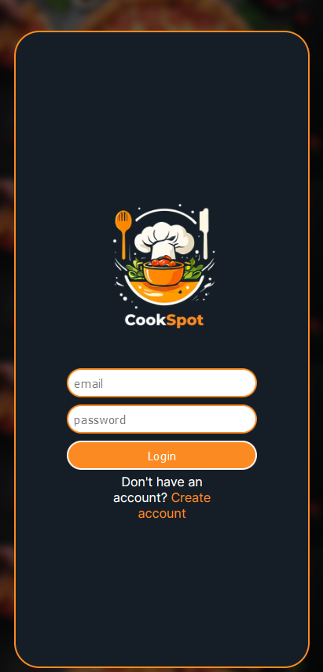

# CookSpot

Welcome to CookSpot, the web app for all your culinary adventures! Whether you're an amateur home cook or a seasoned chef, CookSpot is designed to cater to your every cooking need.

# Table of Contents

1. [Features](#features)
2. [Technology Stack](#technology-stack)
3. [Database Design and Structure](#database-design-and-structure)
4. [Design Patterns](#design-patterns)
5. [Installation](#installation)
6. [Usage](#usage)
7. [Contributing](#contributing)
8. [License](#license)

## Features

- **User Management:** Users can create accounts, log in, and manage their profiles, including changing their username, email, and password.
- **Recipe Management:** Users can create, view, and edit recipe posts. Each recipe can be categorized and rated.
- **Bookmarks:** Users can bookmark recipes for easy access later.
- **Exploration:** Users can explore new and trending recipes.
- **Administrative Features:** Admins can manage the application.
- **Error Handling:** The application has error handling mechanisms to provide feedback when something goes wrong.
- **Advanced Search:** Filter searches based title ingredients or description.
- **Responsive Design:** Platform is fully responsive, making it easy to navigate on various devices.

## Technology Stack

Project is built using a variety of technologies and tools to ensure efficiency, performance, and scalability. Below is a list of the key components:

1. **Front-End:**
   - HTML, CSS, JavaScript: For structuring, styling, and client-side logic.

2. **Back-End:**
   - PHP: Primary server-side programming language.
   - PostgreSQL: Robust and scalable database management system.

3. **Server:**
   - Nginx: High-performance web server.

4. **Containerization:**
   - Docker: For creating, deploying, and running applications in containers.
   - Docker Compose: For defining and running multi-container Docker applications.

5. **Version Control:**
   - Git: For source code management.
   - GitHub: For hosting the repository and facilitating version control and collaboration.

## Database Design and Structure

The project includes a comprehensive design and structure for the database, ensuring efficient data storage and retrieval. Here are the key components:

1. **Entity-Relationship Diagram (ERD):**
   - The `erd.png` file in the main directory provides a visual representation of the database schema. This diagram is useful for understanding the relationships between different entities in the database.l

2. **Database Schema:**
   - The `Database_dump.sql` file contains the SQL commands to create the database structure with testing data.
   - [View Database Script](./Database_dump.sql)
   - The `script.sql` file contains the SQL commands to create the database structure. It defines tables, relationships, and other database elements.
   - [View Database Script](./script.sql)

## Design patterns

1. **MVC (Model-View-Controller)**
   - Separates the application into Model, View, and Controller components.
   - **Example**: [models/Post.php](.src/models/Post.php), [views/shared/display-post.php](./public/views/shared/display-post.php), [controllers/PostController.php](src/controllers/PostController.php)
2. **Repository**
   - Abstracts the data layer, providing a modular structure.
   - **Example**: [PostRepository.php](./src/repository/PostRepository.php)

6. **Template Method**
   - Defines the skeleton of an algorithm in a method, deferring some steps to subclasses.
   - **Example**: [form-controller.js](./public/js/search.js.#L32)
   

## Installation

Project is dockerized for easy setup and deployment. Follow these steps to get the project up and running:

1. **Clone the Repository**
2. **Navigate to the Project Directory**
3. **Docker Setup:**
Ensure Docker and Docker Compose are installed on your system. In the project directory, you'll find Docker configuration files in the `docker/db`, `docker/nginx`, and `docker/php` directories, along with a `Dockerfile` in each.
4. **Build Docker Images:**
`docker-compose build`
5. **Start Docker Containers:**
`docker-compose up`
6. **Access the Application:**
After the containers are up and running, you can access the application through your web browser.

## Usage Preview
### Login Page

:-------------------------:|:-------------------------:
  |  

## License

This project is licensed under the MIT License

